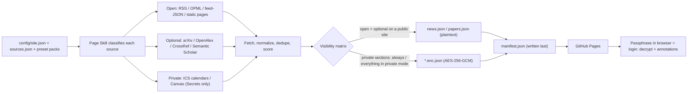

<div align="center">

# Personal Newsdash

## Your news, your papers, your schedule — one auto-updating page that only you can unlock｜Page Skill｜书童Skill

**A serverless news · schedule · research dashboard: GitHub Actions builds static JSON on a cron, GitHub Pages serves it, and anything personal ships as AES-256-GCM ciphertext that only your passphrase — in your browser — can open.**

[](docs/SETUP.md)
[](.github/workflows/update.yml)
[](skills/newsdash/README.md)
[](docs/SETUP.md)
[](LICENSE)

[中文](README.zh.md) · [Setup guide](docs/SETUP.md) · [Security model](docs/SECURITY_MODEL.md) · [Page Skill](skills/newsdash/README.md) · [Data contract](docs/DATA_CONTRACT.md)

</div>

---

## Pick your lane in 30 seconds

**① Just want a personal dashboard** → click **Use this template**, enable Actions, enable Pages. Three clicks, zero API keys — the default presets (AI news + general news) build a working page on the first run.

**② Want it tailored to you** → open the **"Set up my Newsdash · 配置我的新闻台"** issue form and fill in your language, theme, packs, and interests — a workflow commits the config and rebuilds for you. Or paste the [Page Skill kickoff prompt](#tutorial-for-agents) into Claude Code / Codex and let the skill interview you.

**③ Want private mode** → add **one** repository secret, `NEWSDASH_PASSPHRASE`. The pipeline publishes ciphertext only; your browser is the only place it ever decrypts. Entering the passphrase *is* the login.

The three lanes are one road: get a page → make it yours → lock it down.

---

## What is this?

Personal Newsdash is a **GitHub template repository** for a one-person information dashboard. A Python pipeline runs on GitHub Actions cron, writes static JSON into `data/`, commits it back, and a vanilla-JS site on GitHub Pages renders it. No backend, no build step, and zero API keys for the core loop.

It is the successor to [LearnPrompt/ai-news-radar](https://github.com/LearnPrompt/ai-news-radar) (Scout Skill｜伯乐Skill), and it widens the lens: **from an AI-news radar to one person's whole information day.** Where the radar judged *sources of AI news*, Newsdash organizes *everything you read in a day* into three categories:

| Category | What it covers | How it's fetched | Where it lands |
|---|---|---|---|
| **Open** | AI news + general news on public sites | `rss` / `opml` / `feed-json` / `static-page` — plaintext, keyless | `news` section |
| **Optional** | Academic trends in your field | Keyless scholarly APIs: `arxiv` / `openalex` / `crossref` / `semanticscholar` | `papers` section |
| **Private** | Your schedule + course updates | ICS calendars (Google secret iCal, Outlook, Canvas feed) and the Canvas LMS REST API — capability URLs/tokens live **only** in GitHub Secrets | `schedule` + `courses` sections, **always encrypted** |

The in-repo maintainer agent is **Page Skill｜书童Skill** — 书童 is a scholar's study attendant; "Page" puns the page-boy, the pages you read, and GitHub Pages. It parallels the radar's Scout｜伯乐: the Scout judged horses, the Page carries your books.

Three themes ship out of the box — `the-type` (typography-first serif with a vermillion accent), `nyt` (newspaper front page), `bear` (Bear Blog minimalism, auto dark) — with an en/zh runtime language toggle.

## What it can do

### For students

- One page for the whole morning: today's classes and events (ICS calendars), Canvas announcements and upcoming assignments **with submission state**, plus your news feeds
- Everything personal is encrypted at rest on Pages; unlocking with your passphrase is the only login there is
- Highlight, excerpt, and annotate items after unlock; the Clippings view exports Obsidian-friendly Markdown (annotations stay local in IndexedDB)

### For researchers

- Track your field with keyless scholarly APIs: shipped presets include `academic-datavis` (arXiv cs.HC + cs.GR) and `academic-techcomm` (CrossRef ISSN tracking of TCQ, JBTC, IEEE ToPC, JTWC, and Written Communication)
- Papers are deduped DOI-first and scored with a 7-day window and slower decay than news, so weekend-quiet arXiv doesn't empty your feed
- Interest keywords in `config/sources.json` boost what matters to you — no LLM calls anywhere in the pipeline, so scoring is deterministic and free

### For developers and agents

- Zero-key core loop: fork-and-go with no server, no database, no build tooling — the frontend reads static JSON straight off Pages
- A documented, tested [data contract](docs/DATA_CONTRACT.md) between pipeline and frontend, including the encryption envelope and a WebCrypto reference decrypt
- Preset packs + field-by-field overrides: a same-`id` entry in `sources[]` disables or reweights a preset source without copying it
- The in-repo **Page Skill** classifies new sources into Open / Private / Optional, narrates secrets setup (never touching values), and maintains the pipeline

## How it works



Each source is fetched in isolation — one failure never kills the build. Items are deduped by canonical URL (UTM stripped), DOI-first for papers, then title fingerprint. Scoring is `0.45 · recency (exponential decay, 12 h half-life for news / 84 h for papers) + 0.35 · interest-keyword relevance + 0.20 · source weight`. Events and courses are never scored — they stay time-ordered. `manifest.json` is written last as the frontend's atomic commit point.

## Data outputs

Every run regenerates a set of static JSON files under `data/` — the page reads only these. Full schemas live in the [data contract](docs/DATA_CONTRACT.md).

| File | What's inside | Visibility |
|---|---|---|
| `manifest.json` | Discovery: site config, section list, crypto check block, `build_id` for cache busting | **Always plaintext** |
| `news.json` | Open news items, 24 h window, deduped and scored | Plaintext when `visibility: "public"`; encrypted in private mode |
| `papers.json` | Optional scholarly items, 7-day window, authors/venue/DOI | Plaintext when public; encrypted in private mode |
| `schedule.enc.json` | Calendar events, RRULE-expanded in your timezone | **Always encrypted** |
| `courses.enc.json` | Canvas announcements + upcoming assignments with submission state | **Always encrypted** |
| `source-status.json` | Per-source fetch health; private sources appear only as an aggregate — their detail rides inside the encrypted payloads | Plaintext when public; encrypted in private mode |
| `archive.json` | Rolling 14-day archive of open + optional items (cap 3000) | Plaintext when public; encrypted in private mode |

Before the first successful run, the manifest reports `status: "awaiting_first_build"` and the site renders an onboarding screen instead of an empty page.

## Quick start

### Route A — template (no local setup)

1. Click **Use this template → Create a new repository** (public repo recommended — see [cron notes](#github-actions-and-configuration)).
2. Go to the **Actions** tab and enable workflows (GitHub shows a banner on templated repos). Run **Update Newsdash** once via *Run workflow*, or wait for the cron — the first zero-secret build goes green with the default presets.
3. **Settings → Pages → Deploy from a branch → `main` / `(root)`**. Your dashboard is live.
4. Open **Issues → New issue → "Set up my Newsdash · 配置我的新闻台"** and fill in the form: language, visibility, theme, title, timezone, preset packs, extra RSS, interest keywords. The setup workflow (owner-guarded) commits your config, re-runs the build, and replies with a bilingual comment — Pages link, secrets deep links, base64 recipes, and the agent kickoff prompt.
5. For Private / Optional sources, add the secrets listed in that comment (or follow the [setup guide](docs/SETUP.md)) — every source turns itself on the moment its key exists.

### Route B — local

```bash
git clone https://github.com/<your-username>/<your-repo>.git
cd <your-repo>
python3 -m venv .venv && source .venv/bin/activate
pip install -r requirements.txt
python scripts/build.py --output-dir data
python -m http.server 8899
```

Open:

```text
http://localhost:8899
```

Useful extras: `--smoke` (no network, valid-but-empty outputs), `--only open|private|optional` (debug one category), `python scripts/validate_config.py` (schema-check your config), `python -m pytest -q` (55 tests), `node tests/test_crypto_webcrypto.mjs` (browser-side crypto against a Python-encrypted vector). `scripts/encrypt_tool.py encrypt|decrypt|make-vector` works with the passphrase in an env var — never on argv.

## Tutorial for agents

Want Claude Code / Codex to set the whole thing up with you? Paste this:

```text
Use Page Skill for Personal Newsdash. Interview me first: which preset packs I want
(ai-news, general-news, academic-datavis, academic-techcomm), my interest keywords,
my theme and timezone, and whether the site should be public or private. Then classify
any extra sources I give you as Open, Private, or Optional. Walk me through every
GitHub secret step by step — but never ask me to paste a secret value into the chat,
and never commit tokens, calendar URLs, or passphrases into the repo.
```

The skill **narrates** secrets setup — which secret to create, where, and how to encode it — but never touches the values themselves.

- `skills/newsdash/` — **Page Skill｜书童** (maintainer side): classify sources, maintain the pipeline and config, guide deployment. See its [README](skills/newsdash/README.md).
- A reader-side consumer skill (ask your agent "what's on my Newsdash today?") is planned for v0.2.

## GitHub Actions and configuration

`.github/workflows/update.yml` is preconfigured:

- **Cron: `17 */2 * * *`** (2-hourly, off the congested top of the hour). That's roughly 900 Actions minutes/month — safely inside the 2000 free minutes private repos get. On a public repo (unlimited minutes) you may drop to `*/30 * * * *`.
- The bot commits the whole `data/` directory back and self-checks that nothing generated was left unstaged.
- **Key present ⇒ on:** sources with `enabled: "auto"` run iff every env var in their `secret_ref` is set. No key, no fetch, no error — the section just reports `not_configured` and the site shows a setup hint.
- Heads-up: GitHub disables cron schedules after ~60 days of repo inactivity (one click re-enables); the Pages CDN caches ~10 minutes, which the rotating `build_id` defeats; data commits grow history over time (windows are rolling — a squash recipe is in the docs).

### Secrets

| Secret | Unlocks | Notes |
|---|---|---|
| `NEWSDASH_PASSPHRASE` | All encryption | Use ≥4 random words. Rotation = change secret + re-run (old ciphertext stays in git history) |
| `ICS_SOURCES_B64` | `schedule` section | Base64 of a JSON array `[{id,name,url}]` — see `examples/ics-sources.example.json`. Encode: `base64 -i ics-sources.json \| tr -d '\n'` (macOS) / `base64 -w0 ics-sources.json` (Linux) |
| `CANVAS_BASE_URL` | `courses` section | e.g. `https://canvas.iastate.edu` |
| `CANVAS_TOKEN` | `courses` section | Canvas → Account → Settings → **+ New Access Token**. Tokens are full-account — rotate each semester |
| `OPENALEX_API_KEY` | Optional | OpenAlex now rejects most keyless requests; without a key that fetcher is best-effort |
| `FOLLOW_OPML_B64` | Optional | Your radar-compatible OPML, decoded to `feeds/follow.opml` at build time |

### Variables (kill switches + tuning)

| Variable | Purpose |
|---|---|
| `CONTACT_MAILTO` | Joins the CrossRef/OpenAlex polite pools (better rate limits) |
| `ICS_CALENDARS_ENABLED` / `CANVAS_ENABLED` | Set `0` for an emergency stop of that source |
| `RSS_MAX_FEEDS` | Cap on OPML feeds (default 10) |

Policy line, worth memorizing: **keys live in Secrets; tuning lives in config files; Variables exist only as kill switches.**

Everything else is plain JSON under `config/` — `site.json` (title, visibility, theme, timezone, time windows) and `sources.json` (presets, interests, sources), both JSON-Schema validated. The schema **forbids** `url`/`path` on `category: "private"` sources, so a capability URL can never leak into the repo by config mistake.

## Privacy and security

- **Private mode is passphrase encryption, not access control.** The pipeline encrypts with AES-256-GCM; the key is PBKDF2-HMAC-SHA256 over your NFC-normalized passphrase (16-byte salt, 600 000 iterations); your browser decrypts via WebCrypto. `visibility: "public"` keeps open + optional sections plaintext while private sections are always encrypted; `visibility: "private"` encrypts everything and boots the site to a passphrase gate.
- **Secrets never touch the repo.** Calendar capability URLs and Canvas tokens live only in GitHub Secrets; Actions logs withhold private-section counts, titles, and error detail; `source-status.json` redacts private sources down to an aggregate.
- **The ciphertext is public, so the passphrase carries the load.** Weak passphrases can be brute-forced offline — use at least 4 random words. Metadata (file sizes, update cadence, which sections you configured) still leaks and is documented, not hidden.

> **A private site is an encrypted public site — not a private repo.** GitHub Pages is always publicly reachable on free plans.

Threat model, tradeoffs, and the full invariants list: [docs/SECURITY_MODEL.md](docs/SECURITY_MODEL.md).

## License

[MIT](LICENSE)
