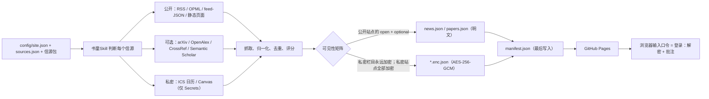

<div align="center">

# Personal Newsdash · 个人新闻台

## 你的新闻、论文与日程——一页自动更新，唯你能解锁｜Page Skill｜书童Skill

**一个无服务器的「新闻 · 日程 · 研究」仪表盘：GitHub Actions 定时生成静态 JSON，GitHub Pages 直接托管；一切私人内容都以 AES-256-GCM 密文发布——只有你的口令、在你的浏览器里，才能打开。**

[](docs/SETUP.zh.md)
[](.github/workflows/update.yml)
[](skills/newsdash/README.md)
[](docs/SETUP.zh.md)
[](LICENSE)

[English](README.md) · [配置指南](docs/SETUP.zh.md) · [安全模型](docs/SECURITY_MODEL.zh.md) · [书童Skill](skills/newsdash/README.md) · [数据契约](docs/DATA_CONTRACT.md)

</div>

---

## 30 秒选边上车

**① 只想要一个属于自己的仪表盘** → 点 **Use this template**（使用此模板），启用 Actions，启用 Pages。三次点击、零 API Key——默认信源包（AI 资讯 + 综合新闻）第一次构建就能出一个可用的页面。

**② 想按自己的口味定制** → 打开 **「Set up my Newsdash · 配置我的新闻台」** Issue 表单，填好语言、主题、信源包和兴趣关键词——机器人自动提交配置并重建。也可以把 [书童Skill 启动提示词](#给-agent-看的教程) 粘贴给 Claude Code / Codex，让它访谈你。

**③ 想要私密模式** → 只需添加**一个**仓库 Secret：`NEWSDASH_PASSPHRASE`。流水线只发布密文；解密只发生在你的浏览器里。输入口令，就是登录。

三条路其实是一条路：先有一页 → 变成你的 → 再上锁。

---

## 这是什么

Personal Newsdash 是一个 **GitHub 模板仓库**，用来搭建单人信息仪表盘。Python 流水线在 GitHub Actions 上定时运行，把静态 JSON 写进 `data/` 并提交回仓库，GitHub Pages 上的纯 JavaScript 页面直接读取渲染。没有后端、没有构建工具链，核心流程零 API Key。

它是 [LearnPrompt/ai-news-radar](https://github.com/LearnPrompt/ai-news-radar)（伯乐Skill｜Scout Skill）的续作，并把视野放宽：**从 AI 资讯雷达，扩展到一个人一整天要读的所有信息。** 雷达判断的是 *AI 新闻的信源*，新闻台整理的是 *你一天的阅读*，分成三类：

| 类别 | 覆盖内容 | 抓取方式 | 落点 |
|---|---|---|---|
| **公开信源（Open）** | AI 资讯 + 综合新闻 | `rss` / `opml` / `feed-json` / `static-page`——明文、免密钥 | `news` 栏目 |
| **可选信源（Optional）** | 你所在领域的学术动态 | 免密钥学术 API：`arxiv` / `openalex` / `crossref` / `semanticscholar` | `papers` 栏目 |
| **私密信源（Private）** | 个人日程 + 课程动态 | ICS 日历（Google 私密 iCal、Outlook、Canvas 日历源）与 Canvas LMS REST API——凭据 URL 和 Token **只**存放在 GitHub Secrets | `schedule` + `courses` 栏目，**永远加密** |

仓库内置的维护侧智能体叫 **Page Skill｜书童Skill**——书童是书斋里的伴读小童；英文 "Page" 一语三关：伴读的书童、你读的页面、还有 GitHub Pages。与雷达的伯乐正好成对：伯乐相马，书童捧书。

开箱自带三套主题——`the-type`（字砌：衬线为骨、朱砂点睛的排印风）、`nyt`（报纸头版）、`bear`（Bear Blog 极简、自动深色）——界面支持中英文随时切换。

## 能做什么

### 给学生

- 一页看完整个早晨：今天的课程与日程（ICS 日历）、Canvas 公告和待交作业（**含提交状态**），加上你的新闻订阅
- 一切私人内容在 Pages 上均为加密存储；用口令解锁就是唯一的登录方式
- 解锁后可以高亮、摘录、写笔记；「摘录」视图可导出 Obsidian 友好的 Markdown（批注仅存在本地 IndexedDB）

### 给研究者

- 用免密钥学术 API 追踪自己的领域：内置 `academic-datavis`（arXiv cs.HC + cs.GR）与 `academic-techcomm`（用 CrossRef 按 ISSN 追踪 TCQ、JBTC、IEEE ToPC、JTWC、Written Communication 五刊）
- 论文按 DOI 优先去重，7 天窗口、比新闻更慢的衰减——arXiv 周末静默不会清空你的论文流
- 在 `config/sources.json` 里写下兴趣关键词即可加权排序——流水线全程零 LLM 调用，排序确定、免费

### 给开发者与 Agent

- 零密钥核心链路：无服务器、无数据库、无构建工具，前端直接读 Pages 上的静态 JSON
- 流水线与前端之间有一份成文且被测试锁定的[数据契约](docs/DATA_CONTRACT.md)，包括加密信封格式和 WebCrypto 参考解密代码
- 信源包 + 按字段覆盖：在 `sources[]` 里写一个同 `id` 条目就能停用或调权某个预置信源，无需复制整包
- 内置 **书童Skill**：为新信源分类（公开/私密/可选）、口述 Secrets 配置（绝不经手值）、维护流水线

## 工作原理



每个信源独立抓取——单个信源失败不会拖垮整次构建。条目先按规范化 URL（剥离 UTM）去重，论文按 DOI 优先，再按标题指纹兜底。评分公式：`0.45 · 新鲜度（指数衰减，新闻半衰期 12 小时 / 论文 84 小时）+ 0.35 · 兴趣关键词相关度 + 0.20 · 信源权重`。日程与课程从不评分——按时间排列。`manifest.json` 最后写入，是前端的原子提交点。

## 数据产物

每次运行都会重新生成 `data/` 下的一组静态 JSON——页面只读取这些文件。完整字段见[数据契约](docs/DATA_CONTRACT.md)。

| 文件 | 内容 | 可见性 |
|---|---|---|
| `manifest.json` | 发现入口：站点配置、栏目清单、口令校验块、用于破缓存的 `build_id` | **永远明文** |
| `news.json` | 公开新闻，24 小时窗口，已去重评分 | `visibility: "public"` 时明文；私密模式加密 |
| `papers.json` | 学术条目，7 天窗口，含作者/期刊/DOI | 公开时明文；私密模式加密 |
| `schedule.enc.json` | 日历事件，RRULE 已按你的时区展开 | **永远加密** |
| `courses.enc.json` | Canvas 公告 + 待交作业（含提交状态） | **永远加密** |
| `source-status.json` | 各信源抓取健康度；私密信源只显示汇总，细节在加密载荷内 | 公开时明文；私密模式加密 |
| `archive.json` | 公开 + 可选条目的 14 天滚动归档（上限 3000 条） | 公开时明文；私密模式加密 |

首次构建成功之前，manifest 报告 `status: "awaiting_first_build"`，页面会渲染引导屏而不是一片空白。

## 快速开始

### 路线 A——模板（无需本地环境）

1. 点击 **Use this template → Create a new repository**（建议公开仓库——原因见 [Actions 配置](#github-actions-与配置)）。
2. 打开 **Actions** 标签页启用工作流（模板仓库会显示提示条）。用 *Run workflow* 手动跑一次 **Update Newsdash**，或等定时任务——第一次零密钥构建即可用默认信源包出结果。
3. **Settings → Pages → Deploy from a branch → `main` / `(root)`**。你的仪表盘就上线了。
4. 打开 **Issues → New issue → 「Set up my Newsdash · 配置我的新闻台」**，填表：语言、可见性、主题、标题、时区、信源包、自定义 RSS、兴趣关键词。配置工作流（仅响应仓库所有者）会提交你的配置、重新构建，并用中英双语回帖：Pages 链接、Secrets 清单与直达链接、base64 配方、AI 启动提示词。
5. 私密 / 可选信源：按回帖清单添加 Secrets（或看[配置指南](docs/SETUP.zh.md)）——密钥一旦存在，对应信源即自动开启。

### 路线 B——本地

```bash
git clone https://github.com/<your-username>/<your-repo>.git
cd <your-repo>
python3 -m venv .venv && source .venv/bin/activate
pip install -r requirements.txt
python scripts/build.py --output-dir data
python -m http.server 8899
```

打开：

```text
http://localhost:8899
```

其他常用命令：`--smoke`（不联网，产出合法的空数据）、`--only open|private|optional`（按类别调试）、`python scripts/validate_config.py`（校验配置）、`python -m pytest -q`（55 个测试）、`node tests/test_crypto_webcrypto.mjs`（用 Python 加密的测试向量验证浏览器侧解密）。`scripts/encrypt_tool.py encrypt|decrypt|make-vector` 从环境变量读取口令——绝不走命令行参数。

## 给 Agent 看的教程

想让 Claude Code / Codex 帮你从头配好？粘贴这段：

```text
Use Page Skill for Personal Newsdash. Interview me first: which preset packs I want
(ai-news, general-news, academic-datavis, academic-techcomm), my interest keywords,
my theme and timezone, and whether the site should be public or private. Then classify
any extra sources I give you as Open, Private, or Optional. Walk me through every
GitHub secret step by step — but never ask me to paste a secret value into the chat,
and never commit tokens, calendar URLs, or passphrases into the repo.
```

书童只**口述** Secrets 配置——建哪个、在哪建、值怎么生成——但绝不经手值本身。

- `skills/newsdash/` —— **Page Skill｜书童**（维护侧）：信源分类、维护流水线与配置、指导部署。见其[说明页](skills/newsdash/README.md)。
- 读者侧的消费 Skill（对 Agent 说「今天我的新闻台上有什么？」）排在 v0.2。

## GitHub Actions 与配置

`.github/workflows/update.yml` 已经配好：

- **Cron：`17 */2 * * *`**（每 2 小时，避开整点拥堵）。约合每月 900 分钟 Actions 用量——稳稳低于私有仓库每月 2000 分钟的免费额度。公开仓库（分钟数不限）可以放心改成 `*/30 * * * *`。
- 机器人把整个 `data/` 目录提交回仓库，并自检没有遗漏任何生成文件。
- **有密钥就自动开**：`enabled: "auto"` 的信源只在 `secret_ref` 列出的环境变量齐备时运行。没密钥就不抓、也不报错——栏目只显示 `not_configured`，页面给出配置提示。
- 注意：仓库约 60 天无活动后 GitHub 会自动停掉定时任务（一键恢复）；Pages CDN 缓存约 10 分钟，靠轮换的 `build_id` 破解；数据提交会让历史慢慢变大（窗口是滚动的，压缩配方见文档）。

### Secrets

| Secret | 开启 | 备注 |
|---|---|---|
| `NEWSDASH_PASSPHRASE` | 全部加密 | 至少 4 个随机单词。轮换 = 改 Secret + 重跑（旧密文仍留在 git 历史里） |
| `ICS_SOURCES_B64` | `schedule` 栏目 | JSON 数组 `[{id,name,url}]` 的 base64——见 `examples/ics-sources.example.json`。编码：macOS `base64 -i ics-sources.json \| tr -d '\n'`；Linux `base64 -w0 ics-sources.json` |
| `CANVAS_BASE_URL` | `courses` 栏目 | 如 `https://canvas.iastate.edu` |
| `CANVAS_TOKEN` | `courses` 栏目 | Canvas → Account → Settings → **+ New Access Token**。Token 是全账户权限——每学期轮换 |
| `OPENALEX_API_KEY` | 可选 | OpenAlex 现在大多拒绝免密钥请求；无 Key 时该信源尽力而为 |
| `FOLLOW_OPML_B64` | 可选 | 兼容雷达的私人 OPML，构建时解码到 `feeds/follow.opml` |

### Variables（急停开关 + 微调）

| Variable | 用途 |
|---|---|
| `CONTACT_MAILTO` | 加入 CrossRef/OpenAlex 的礼貌池（更好的限速待遇） |
| `ICS_CALENDARS_ENABLED` / `CANVAS_ENABLED` | 设为 `0` 即急停该信源 |
| `RSS_MAX_FEEDS` | OPML 展开的订阅数上限（默认 10） |

一句话方针，值得背下来：**密钥进 Secrets；调参进配置文件；Variables 只当急停开关。**

其余一切都是 `config/` 下的纯 JSON——`site.json`（标题、可见性、主题、时区、时间窗口）与 `sources.json`（信源包、兴趣、信源），全部由 JSON Schema 校验。Schema **禁止**在 `category: "private"` 的信源上写 `url`/`path`——凭据 URL 从结构上就进不了仓库。

## 隐私与安全

- **私密模式是口令加密，不是访问控制。** 流水线用 AES-256-GCM 加密；密钥由 NFC 规范化后的口令经 PBKDF2-HMAC-SHA256（16 字节盐、600 000 次迭代）派生；浏览器用 WebCrypto 解密。`visibility: "public"` 时公开/可选栏目保持明文、私密栏目永远加密；`visibility: "private"` 时全站加密、页面直接进入口令门。
- **密钥永不触碰仓库。** 日历凭据 URL 和 Canvas Token 只存在于 GitHub Secrets；Actions 日志不打印私密栏目的条数、标题与错误细节；`source-status.json` 把私密信源折叠成一行汇总。
- **密文是公开的，所以口令承担全部重量。** 弱口令可被离线爆破——请用至少 4 个随机单词。元数据（文件大小、更新节奏、配置了哪些栏目）仍会泄露，我们如实写明而不是假装没有。

> **私密站点是一个加密的公开站点——而不是一个私有仓库。** 免费版 GitHub Pages 永远可被公网访问。

完整威胁模型与不变量清单：[docs/SECURITY_MODEL.zh.md](docs/SECURITY_MODEL.zh.md)。

## License

[MIT](LICENSE)
